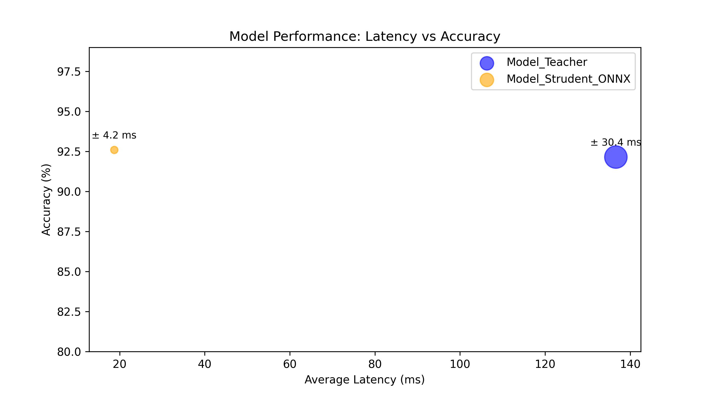

# 📊 SentimentAnalysis - Emotion Detection with BERT & DistilBERT


## 🌟 Overview  

**SentimentAnalysis** is a **Natural Language Processing (NLP) model** designed for **emotion detection**, trained on the **dair-ai/emotion** dataset. The model supports both **BERT (`bert-base-uncased`)** and **DistilBERT (`distilbert-base-uncased`)**, offering a **balance between accuracy and efficiency**.  

To enhance performance and reduce computational costs, the **DistilBERT** variant is optimized using:  
- **Knowledge Distillation** 🧠 – Transfers knowledge from a larger model to a smaller one.  
- **ONNX Optimization** ⚡ – Converts the model to ONNX format for faster inference.  
- **Quantization** 🔢 – Reduces model size and speeds up computations while maintaining accuracy.  

This model can classify text into **multiple emotional categories**, making it useful for:  
✅ **Chatbots** 🤖 – Understanding user emotions in real-time.  
✅ **Sentiment Analysis** 📊 – Analyzing customer opinions and trends.  
✅ **Customer Feedback Processing** 📝 – Improving user experience based on feedback.  
✅ **Social Media Monitoring** 📢 – Detecting emotional trends on platforms like Twitter and Facebook.  

📝 With these optimizations, **SentimentAnalysis** is well-suited for **real-time applications with limited resources**.

## 🚀 Features

- 🧠 **Supports BERT & DistilBERT** for flexible trade-off between speed and accuracy  
- 📊 **Trained on `dair-ai/emotion`**, detecting emotions like joy, anger, sadness, etc.  
- ⚡ **Efficient inference with DistilBERT** for real-time applications  
- 🔄 **Pretrained models available via Hugging Face**  

## 📦 Installation

1️⃣ **Clone the repository**  
   ```bash
   git clone https://github.com/LeTien12/SentimentAnalysis.git
   ```

2️⃣ **Navigate to the project directory**
   ```bash
    cd SentimentAnalysis
   ```

3️⃣ **Activate the Poetry virtual environment**  
   ```bash
   poetry shell
   ```

4️⃣ **Install dependencies**  
   ```bash
   poetry install
   ```

5️⃣ **run project**  
   ```bash
   poe run
   ```

## 🐳 Run with Docker

1️⃣ **Pull the prebuilt Docker image**  
   ```bash
   docker pull tienle080102/my-classify-app
   ```

2️⃣ **Run the Docker container**  
   ```bash
   docker run -p 8501:8501 tienle080102/my-classify-app
   ```

3️⃣ **Access the application**  
   ```bash
   👉 http://localhost:8501
   ```

## 📊 Model Performance
## 🚀 Introduction
- **🟪 Model_Teacher**: Higher accuracy but significantly higher latency.
- **🟨 Model_Student_ONNX**: Lower latency while maintaining competitive accuracy.
 


## 📏 Model Size
- **🟨 Model_Student_ONNX**: **43.8 MB**  
  - Optimized using **ONNX**, **quantization**, and **graph restructuring** to reduce size and improve speed.

- **🟪 Model_Teacher**: **417.72 MB**  
  - Larger and more precise, but with significantly higher latency.

## 🔍 Observations
- 🏆 **Model_Student_ONNX is much faster** (~20ms vs. ~140ms for Model_Teacher).
- 🎯 **Accuracy remains nearly the same** (~92.6% vs. ~92.1%).
- 💡 **Optimization potential**: Further improvements can be made using pruning.

## 🔥 Benchmarks
Both BERT and DistilBERT are fine-tuned on dair-ai/emotion, detecting emotions across six categories:
😃 Joy | 😡 Anger | 😢 Sadness | 😱 Fear | 🤢 Disgust | 😯 Surprise

## 🤝 Contributing
We welcome contributions! Follow these steps to contribute:

Fork the repo and create a new branch
Make your changes and test them
Open a Pull Request
For major changes, please open an issue first to discuss your proposal.

## 📄 License
- This project is licensed under the MIT License - see the LICENSE file for details.

## 🌟 Acknowledgments
## 🤗 Hugging Face Transformers for BERT & DistilBERT
## 📚 PyTorch for model training
## 📊 dair-ai/emotion dataset for emotion classification

